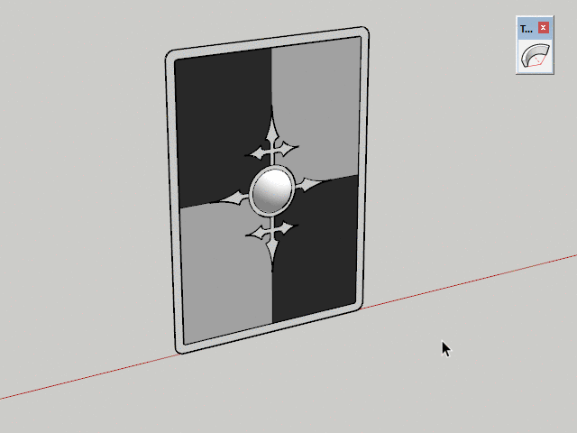
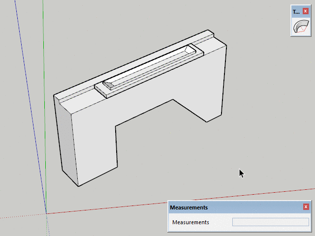
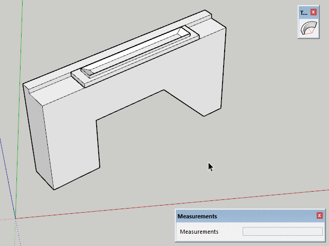
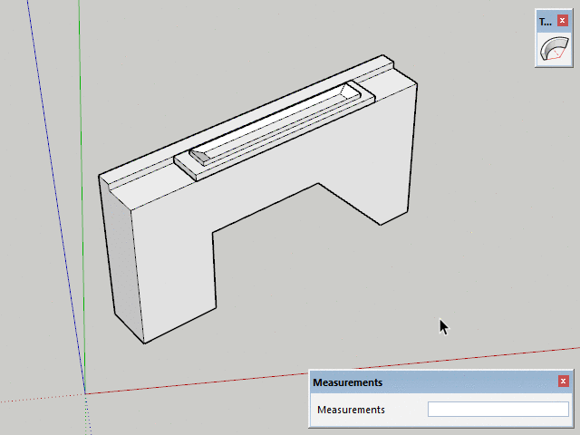

# TrueBend

SketchUp extension allowing you to bend instances to a given degree or radius, preserving the original length.

## Example Usage

Use the VCB to enter an accurate bend angle:

Use the VCB to adjust the segmentation by appending "s":

Toggle soft+smooth for the newly created edges:

## VCB Input

By default the VCB accept bend angle. But you can switch to other modes by appending a unit type:

* Angle Input: `45deg`
* Segment Count: `8s`
* Bend Distance: `500mm` (This should be a value less than the width of the bottom from bounding box segment.)
